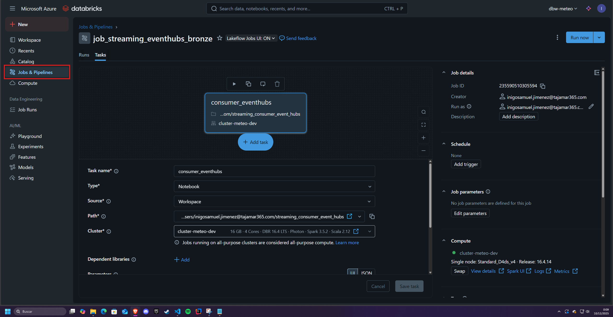
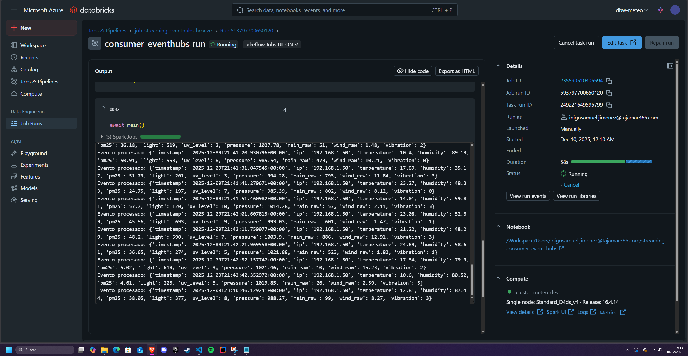
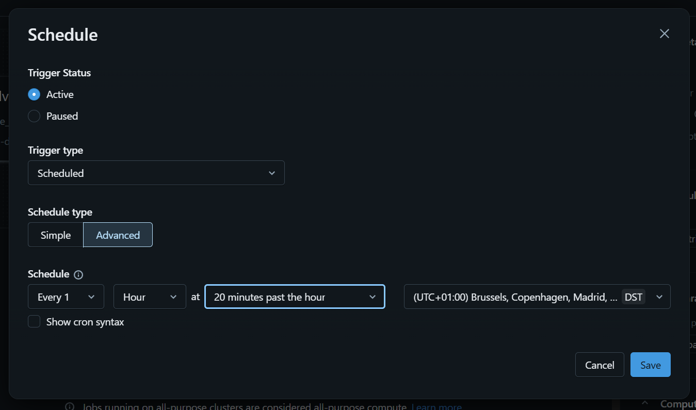

# Configuración de Databricks Jobs para Arquitectura Medallion

Este documento describe paso a paso cómo configurar los tres Jobs necesarios para orquestar el pipeline completo del proyecto (streaming + batch) en Databricks.

---

# 1. Job 1 — Streaming Event Hubs → Bronze

## Objetivo
Consumir datos en tiempo real desde Azure Event Hubs y almacenarlos en la capa Bronze.

## Pasos para crearlo

1. En el menú izquierdo de Databricks, selecciona **Workflows → Jobs**.
2. Haz clic en **Create Job**.
3. Asigna el nombre: `job_streaming_eventhubs_bronze`.
4. En la sección **Tasks**, configura:
   - **Task name:** `consumer_eventhubs`
   - **Type:** Notebook
   - **Notebook path:** selecciona `streaming_consumer_eventhubs`
5. En **Compute**:
   - Usa tu cluster existente (recomendado).
6. Configura los ajustes críticos:
   - **Retries:** 3
7. Pulsa **Create**.
8. Para iniciarlo, abre el Job y haz clic en **Run now**.

---

# 2. Job 2 — Streaming Bronze → Silver

## Objetivo
Tomar los datos de Bronze (streaming) y transformarlos hacia Silver en tiempo real.

## Pasos

1. En **Workflows → Jobs**, crea un nuevo Job.
2. Nombre: `job_streaming_bronze_to_silver`
3. En **Tasks**:
   - **Task name:** `bronze_to_silver_streaming`
   - **Type:** Notebook
   - **Notebook path:** `bronze_to_silver_streaming`
4. Configura **Compute** igual que en el Job anterior.
5. Ajustes importantes:
   - **Retries:** 3
6. Guarda el Job.
7. Inicia el pipeline ejecutando **Run now** cuando el Job 1 esté corriendo.

---

# 3. Job 3 — Batch ETL (Bronze Batch → Silver → Gold)

## Objetivo
Procesar los datos batch que llegan al Data Lake y actualizar Silver y Gold.

Este Job incluye dos tareas encadenadas.

---

## 3.1 Crear el Job

1. En **Workflows → Jobs**, selecciona **Create Job**.
2. Asigna el nombre: `job_batch_etl_weather`.

---

## 3.2 Task A — Bronze Batch → Silver

1. En la tarea inicial:
   - **Task name:** `bronze_to_silver_batch`
   - **Type:** Notebook
   - **Notebook path:** `bronze_to_silver_batch_weather`
2. Configurar **Compute** (recomendado):
   - Usa tu cluster existente
3. Ajustes:
   - **Retries:** 2
   - **Retry interval:** 5 min

---

## 3.3 Task B — Silver → Gold

1. Pulsa **Add task**.
2. Configura:
   - **Task name:** `silver_to_gold`
   - **Type:** Notebook
   - **Notebook path:** `silver_to_gold_weather`
3. En **Depends on**, selecciona:
   - `bronze_to_silver_batch`
4. Configura **Compute**:
   - Usar el mismo job cluster o uno nuevo.
5. Ajustes:
   - **Retries:** 2
   - **Retry interval:** 20–30 min

---

## 3.4 Programación del Job

1. En la parte inferior del Job, pulsa **Add schedule**.
2. Configúralo:
   - **Every:** 1 hour
   - **Start time:** cualquiera
   - **Timezone:** Europe/Madrid
3. Guarda el schedule.

---

# 4. Resumen Final de los Jobs

| Job | Función | Tipo | Estado |
|-----|---------|------|--------|
| Job 1 | Event Hubs → Bronze | Streaming | Ejecutándose continuamente |
| Job 2 | Bronze → Silver | Streaming | Ejecutándose continuamente |
| Job 3 | Bronze Batch → Silver → Gold | Batch | Programado cada hora |

---

# 5. Inicio de Pipelines

### Para pruebas/demostración:
1. Ejecutar Job 1  
2. Ejecutar Job 2  
3. Dejar que Job 3 se ejecute según schedule o ejecutarlo manualmente

### En producción:
- Jobs 1 y 2 corren permanentemente  
- Job 3 corre automáticamente cada hora

---

