# Conexión de Power BI con Azure Databricks

Este documento explica de forma clara y estructurada cómo se ha realizado la conexión entre **Power BI Desktop** y **Azure Databricks**, incluyendo los cambios necesarios en la configuración del clúster y la actualización del notebook `silver_to_gold` para mantener sincronizada la tabla Hive utilizada por Power BI.

---

## 1. Requisitos previos

Antes de realizar la conexión, se necesita:

* Un **workspace de Azure Databricks** funcionando.
* Un **clúster activo** (no SQL Warehouse).
* Acceso al **Azure Data Lake Storage Gen2 (ADLS)** donde se encuentra el tier Gold.
* Power BI Desktop instalado.
* La tabla **`weather_gold`** creada en Databricks o su ruta Delta correspondiente.

---

## 2. Configuración del clúster de Azure Databricks

Power BI consulta Databricks mediante **DirectQuery u ODBC**, lo que obliga a que el clúster tenga permisos válidos para leer directamente del **Data Lake**.

Debido a que este entorno no utiliza **Unity Catalog**, la autenticación debe hacerse mediante **Storage Account Key**.

### 2.1. Añadir las claves del Storage en la Spark Config

En Databricks:

1. Ir a **Compute**.
2. Seleccionar el clúster utilizado por Power BI.
3. Pulsar **Edit**.
4. Abrir **Advanced Options → Spark Config**.
5. Añadir la siguiente configuración:

```
spark.hadoop.fs.azure.account.key.<storage-account-name>.dfs.core.windows.net <storage-account-key>
spark.hadoop.fs.azure.createRemoteFileSystemDuringInitialization true
```

Esto permite que el clúster acceda sin errores a las rutas `abfss://...` donde se encuentran los datos del tier Gold.

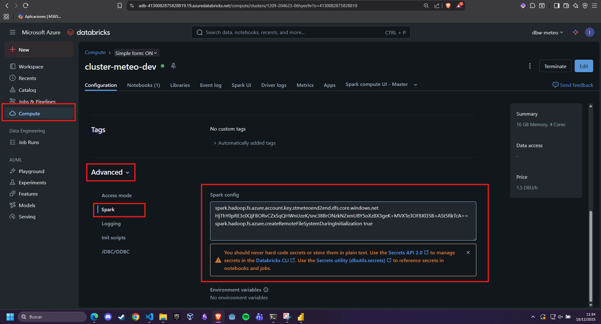

### 2.2. Reinicio del clúster

Después de aplicar la configuración:

* Detener el clúster.
* Iniciarlo nuevamente.

Este reinicio es imprescindible para que Power BI pueda consultar las tablas sin devolver errores ODBC.

---

## 3. Modificación del notebook `silver_to_gold`

Al inicio, el proceso Gold solo hacía:

```
df_gold.write.format("delta").mode("overwrite").save(GOLD_PATH)
```

Esto **actualizaba los archivos Delta**, pero **no actualizaba la tabla Hive** que Power BI consulta a través de DirectQuery.

Para solucionarlo, se añadieron dos pasos adicionales:

### 3.1. Crear la tabla Hive (si no existe)

```python
%sql
CREATE TABLE IF NOT EXISTS default.weather_gold
USING DELTA
LOCATION '{GOLD_PATH}'
```

### 3.2. Refrescar la tabla Hive en cada ejecución

```python
%sql
REFRESH TABLE default.weather_gold
```

Con esto, el pipeline `silver_to_gold` garantiza que:

* La tabla `weather_gold` apunta siempre al GOLD actual.
* Los cambios se reflejan automáticamente en Power BI.

## 4. Cambio en los jobs
Para que los datos en streaming se actualicen debemos cambiar el Job 3: Batch ETL (Bronze Batch → Silver → Gold).

En este caso eliminamos la segunda tarea del job. Y guardamos.

Creamos un nuevo job que ejecute el nuevo notebook silver_to_gold.ipynb cada pocos segundos.

## Objetivo
Tomar los datos de Silver y transformarlos hacia Gold en tiempo real.

## Pasos

1. En **Workflows → Jobs**, crea un nuevo Job.
2. Nombre: `job_silver_to_gold`
3. En **Tasks**:
   - **Task name:** `silver_to_gold`
   - **Type:** Notebook
   - **Notebook path:** `silver_to_gold`
4. Configura **Compute** con tu clúster.
5. Ajustes importantes:
   - **Retries:** 3
   - **Schedule** cada minuto
6. Guarda el Job.
7. Inicia el pipeline ejecutando **Run now** cuando el Job 1 y el Job 2 estén corriendo.

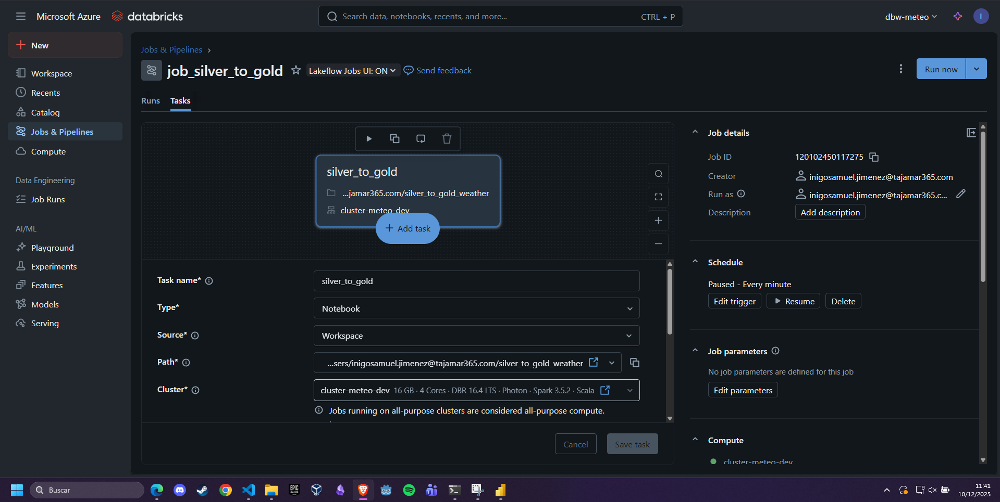

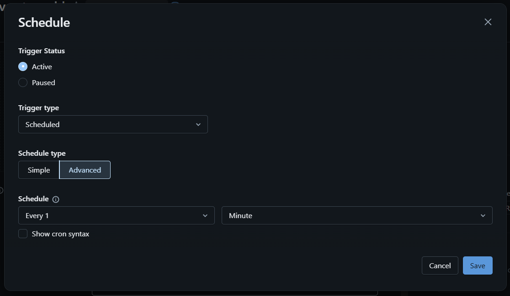

---

## 4. Conexión desde Power BI Desktop

En databricks debemos ir a **Compute** → **Tu cluster** → **Configuration** → **Advanced** → **JDBC/ODBC**

Y apuntar el **`Server hostname`** y el **`HTTP Path`**

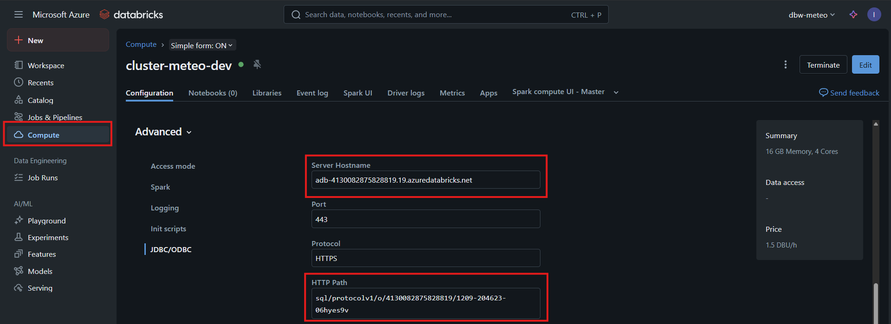

También debemos crear un **`Access Token`** en databricks.
- En Databricks, arriba a la derecha → User Settings
- Pestaña Developer
- Sección Access Tokens → Generate New Token
- Copia el token

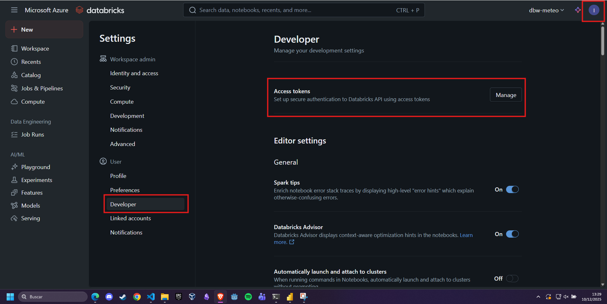

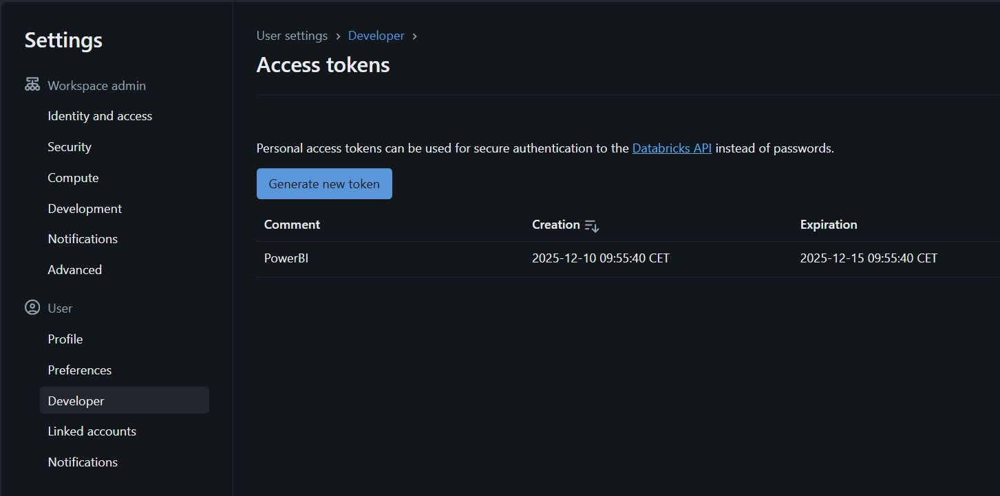

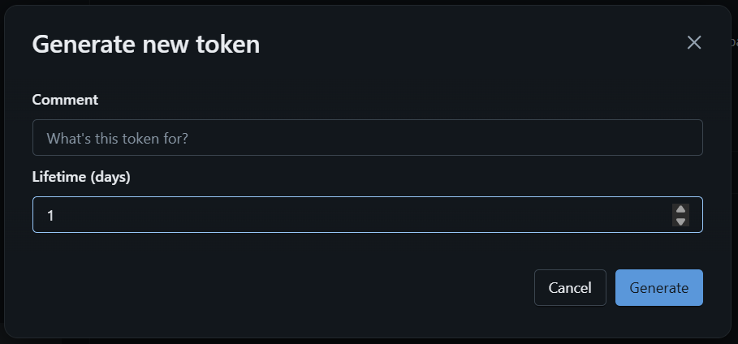

Una vez configurado el clúster y actualizada la tabla, la conexión se realiza así:

1. En Power BI → **Obtener datos**.
2. Seleccionar **Azure Databricks**.
3. Introducir:

   * **Server hostname** ← obtenido de la URL del workspace.
   * **HTTP Path** ← obtenido del clúster, pestaña JDBC/ODBC.

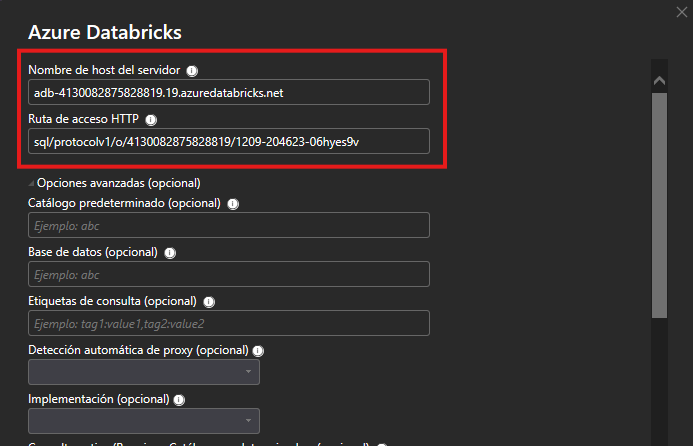

4. Autenticación mediante **Access Token** generado en Databricks.
5. Seleccionar el modo **DirectQuery** para refresco en tiempo real.

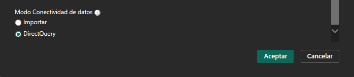

6. Elegir la tabla Hive: **default.weather_gold**.

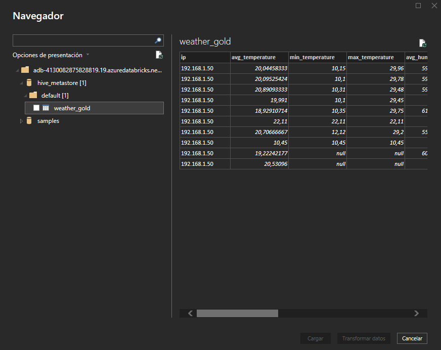

Esto permite que Power BI lea los datos directamente del clúster sin necesidad de importarlos.

---

## 5. Actualización en tiempo real (Auto Page Refresh)

Para visualizar los datos de Databricks en tiempo real:

1. En Power BI, seleccionar el lienzo.
2. Ir al panel de formato.
3. Activar **Auto Page Refresh**.
4. Establecer un intervalo, por ejemplo **5 segundos**.

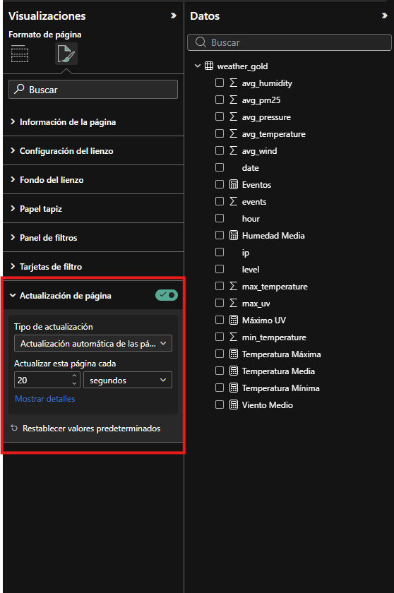

Combinado con DirectQuery y la tabla Gold actualizada, Power BI muestra los cambios casi al instante.

---

## 6. Resumen del proceso

* Se configuró el clúster para acceder a ADLS usando **Storage Account Key**.
* Se modificó el notebook `silver_to_gold` para **crear y refrescar la tabla Hive `weather_gold`**.
* Power BI se conectó vía **DirectQuery**, utilizando el conector de Azure Databricks.
* Se habilitó el **Auto Page Refresh** para mostrar datos en tiempo casi real.

Este flujo permite que el dashboard de Power BI se mantenga actualizado conforme Databricks vuelca nuevos datos al tier Gold.

Ejemplo del dashboard completo:
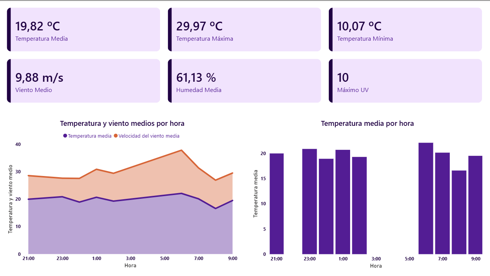

---

## 7. Estado final

Con esta configuración combinada:

* El clúster lee correctamente el almacenamiento.
* La tabla Hive está sincronizada con el GOLD.
* Power BI puede consultar sin errores.
* El dashboard se actualiza automáticamente.

Este enfoque implementa correctamente un pipeline de análisis en tiempo (casi) real usando Azure Databricks + Power BI.
