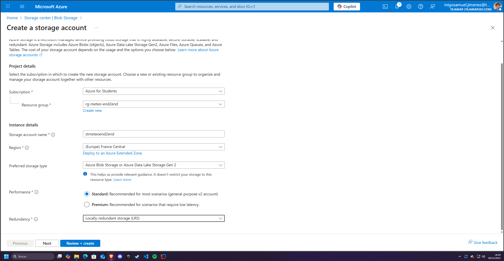
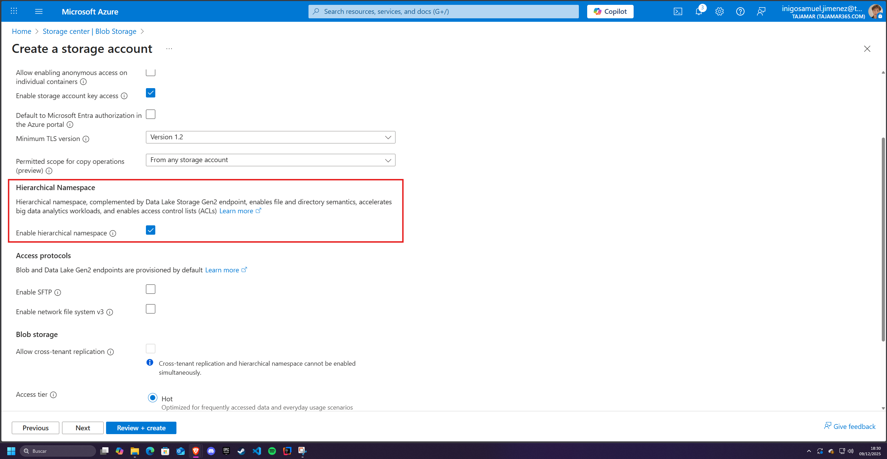
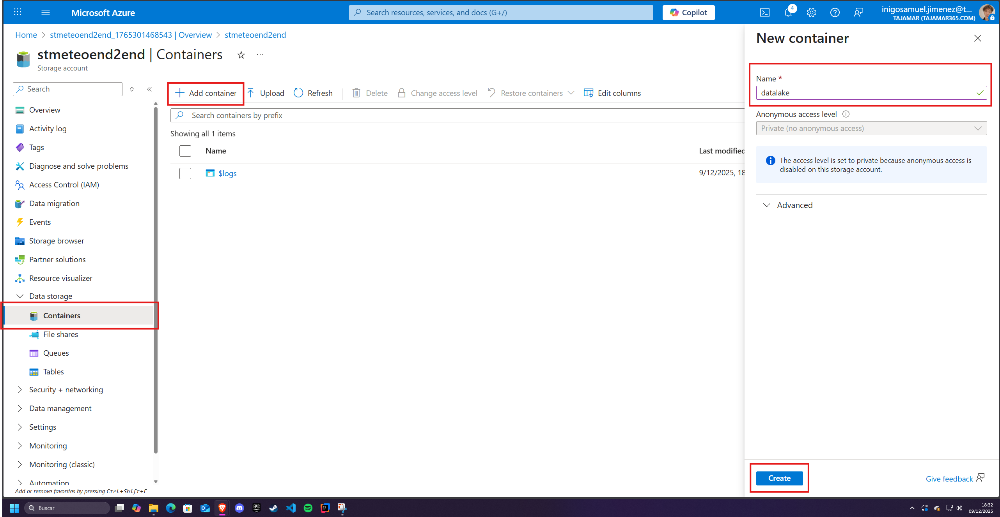
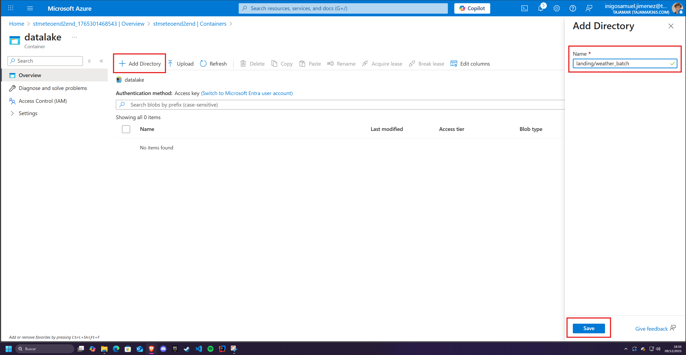
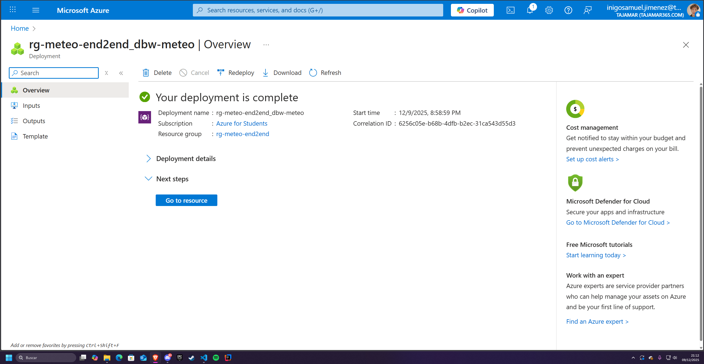
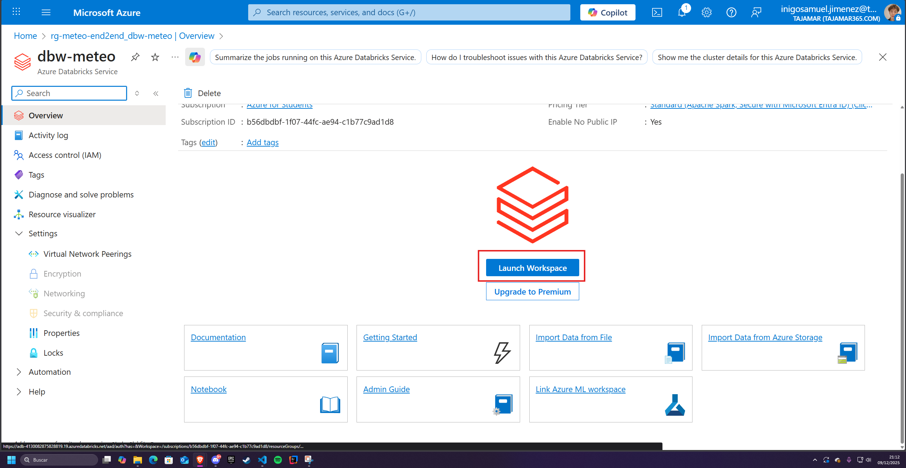
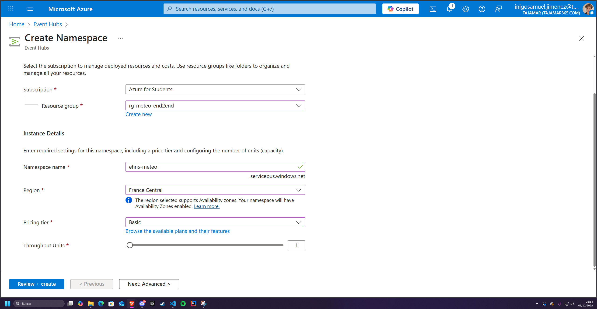
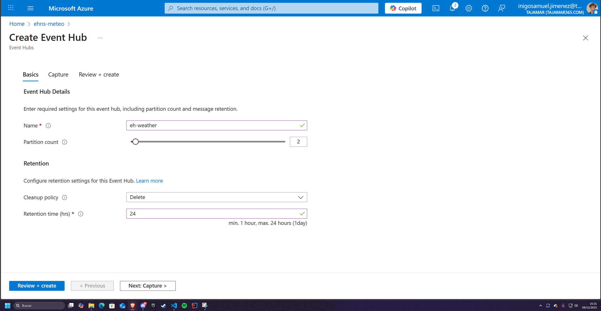
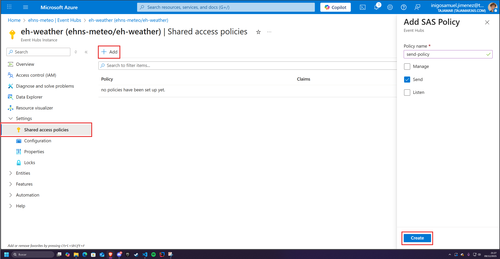
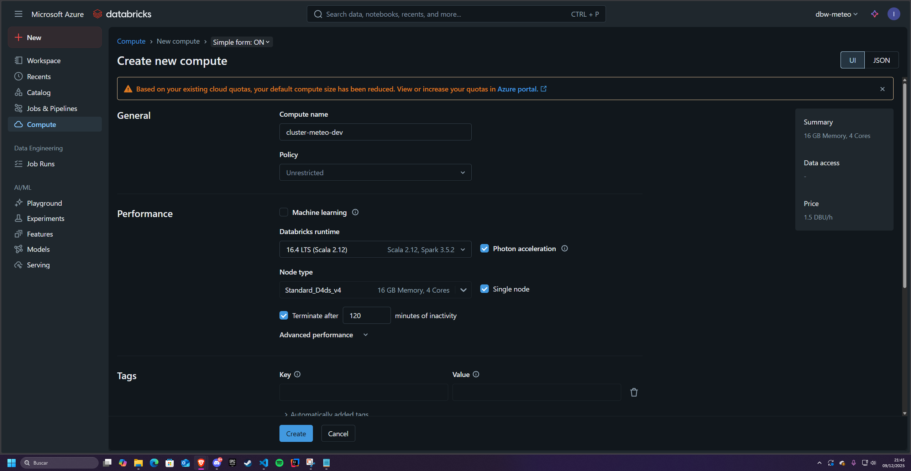

# Tutorial de Despliegue End-to-End en Azure — Proyecto Meteo Big Data

## 1. Crear Resource Group
1. Ir a https://portal.azure.com
2. Buscar **Resource groups** → **Create**
3. Subscription: la tuya
4. Resource group name: `rg-meteo-end2end`
5. Region: elige una (por ejemplo France Central, West Europe o North Europe).
6. Review + create → Create

## 2. Crear Storage Account (ADLS Gen2)
1. Buscar **Storage accounts** → **Create**
2. Basics:
   - Subscription: la misma
   - Resource group: `rg-meteo-end2end`
   - Storage account name: `stmeteoend2end`
   - Region: la misma que el RG si puedes
   - Performance: Standard
   - Redundancy: LRS



1. Advanced:
   - Activa **Enable hierarchical namespace** →  (esto lo convierte en ADLS Gen2).
2. Review + create → Create



### Crear contenedor y carpetas
- Cuando termine, entra en el recurso `stmeteoend2end`.
- En el menú izquierdo, ve a Containers.
- Pulsa + Container:
   - Name: `datalake`
   - Public access level: Private (no anonymous access)
   - Create.



- Entra en el contenedor datalake.
- Crea carpetas (botón + Add directory):
  - Carpetas:
    ```
    /bronze/streaming/weather
    /bronze/batch/weather
    /silver/weather
    /gold/weather
    ```



## 3. Crear Azure Databricks Workspace
1. Buscar **Azure Databricks** → **Create**
2. Basics:
   - Resource group: `rg-meteo-end2end`
   - Name: `dbw-meteo`
   - Region: misma
   - Pricing Tier: Standard
3. Review + create → Create



Cuando esté desplegado:
- Ve al recurso `dbw-meteo`
- Pulsa Launch Workspace (te abrirá la UI de Databricks en otra pestaña)



## 4. Crear Event Hubs Namespace + Event Hub
1. Buscar **Event Hubs** → **Create**
2. Basics:
   - Resource group: `rg-meteo-end2end`
   - Namespace: `ehns-meteo`
   - Region: misma
   - Tier: Basic
   - Pulsa Review + create → Create



3. Una vez creado:
   - Abrir namespace → **Entities** → **Event Hubs** → **+ Event Hub**
   - Nombre: `eh-weather`
   - Partitions: 2
   - Retention: 1 día



### SAS Policies
1. Dentro de eh-weather, ve a Settings → Shared access policies:
2. Pulsa + Add:
   1. Name: `send-policy`
   2. Marca permiso `Send`.
   3. Crear.
3. Otra + Add:
   1. Name: listen-policy
   2. Marca permiso Listen.
   3. Crear.



> En cada policy, entra y copia la Connection string–primary key:
> - send-policy → la usarás en el script Python producer.
> - listen-policy → la usarás en Databricks.


## 5. Configuración Inicial en Databricks
### Crear Cluster
- Compute → Create
- Name: `cluster-meteo-dev`
- Mode: Single node
- Runtime: uno reciente que incluya Spark 3.x y Delta (por ejemplo 16.4 LTS (includes Apache Spark 3.5.2, Scala 2.12))
- Node type: pequeño



## 6. Arquitectura Medallion en Databricks

### 6.1 Notebook 1 — Streaming: Event Hubs → Delta

Notebook: [streaming_consumer_event_hubs.ipynb](../notebooks_databricks/streaming_consumer_event_hubs.ipynb)

Este notebook consume datos de **Event Hubs** usando la librería `azure-eventhub` en modo asíncrono.

### 6.2 Notebook 2 — Streaming bronze to silver

Notebook: [bronze_to_silver_streaming_weather.ipynb](../notebooks_databricks/bronze_to_silver_streaming_weather.ipynb)

Lee desde
```
/bronze/streaming/weather
```
y escribe en:
```
/silver/weather
```

Transformaciones aplicadas:

* Cast de tipos
* Normalización
* Añadir columna `source` (streaming)
* Eliminación de duplicados

### 6.3 Notebook 3 — Batch bronze to silver

Notebook: [bronze_to_silver_batch_weather.ipynb](../notebooks_databricks/bronze_to_silver_batch_weather.ipynb)

Lee CSV desde
```
/bronze/batch/weather
```
y escribe en:

```
/silver/weather
```

Transformaciones aplicadas:

* Cast de tipos
* Normalización
* Añadir columna `source` (batch)
* Eliminación de duplicados

### 6.4 Notebook 4 — Silver → Gold

Notebook: [silver_to_gold_weather.ipynb](../notebooks_databricks/silver_to_gold_weather.ipynb)

Cálculos:

* Métricas horarias (media, máxima, mínima)
* Métricas diarias
* Escritura particionada por fecha

Salida:

```
/gold/weather
```

## 7. Configuración de Jobs en Databricks

En este proyecto se ha optado por utilizar Databricks Jobs en lugar de Azure Data Factory (ADF) para orquestar el pipeline de ingesta y transformación debido a que la lógica principal está implementada directamente en notebooks de Databricks y hace un uso intensivo del motor Spark.

Databricks Jobs permite ejecutar estos notebooks de forma nativa, eficiente y con menor latencia que ADF, evitando la sobrecarga de configurar una integración adicional entre herramientas.

Además, Databricks ofrece un control más granular del ciclo de vida del cluster, ejecución secuencial o paralela de notebooks, manejo de dependencias y reintentos. Aunque ADF es una herramienta excelente para ETL visual y orquestación compleja entre distintos servicios, en un escenario centrado en procesamiento distribuido con Spark resulta más natural, simple y económico mantener toda la canalización dentro del propio entorno Databricks.

Tutorial para el despliegue: [Configurar Jobs Databricks](./paso_a_paso_jobs.md).

## 8. Integración prevista con Power BI (no implementada por problemas de autenticación)

### Ya implementada. Más información [aquí](./power_bi_config.md).

La arquitectura diseñada para este proyecto contempla que Power BI consuma directamente los datos del **tier Gold** del Lakehouse para generar paneles de visualización en tiempo real o cuasi tiempo real.  
Para ello, la opción recomendada consistía en utilizar **Azure Synapse Analytics Serverless SQL** como capa de consulta intermedia entre el Delta Lake y Power BI.

El flujo previsto era el siguiente:

1. Crear en Synapse una **vista SQL** sobre los datos Gold mediante `OPENROWSET` con formato `DELTA`.
2. Exponer esta vista a Power BI como un origen SQL.
3. Conectarse desde Power BI usando **Azure Active Directory (AAD)** como mecanismo de autenticación.
4. Configurar el modelo en **DirectQuery** para obtener refresco dinámico de los datos procesados por Databricks.

Sin embargo, durante la implementación se encontraron **problemas persistentes de autenticación** entre Power BI Desktop y el servicio de SQL Serverless de Synapse.  
A pesar de que el workspace contaba con:
- Un **SQL Active Directory Admin** configurado correctamente,
- Permisos adecuados para el usuario en Azure y en el propio workspace,
- Acceso validado desde Synapse Studio mediante AAD,

Power BI no consiguió establecer una sesión válida y devolvía errores de inicio de sesión asociados a la autenticación OAuth con Synapse SQL. Este comportamiento impidió finalizar la conexión con éxito.

Por esta razón, la integración con Power BI no se ha podido completar en esta fase del proyecto.  
No obstante, el diseño de la arquitectura y las capas del Lakehouse permiten incorporar esta conexión en el futuro mediante cualquiera de las siguientes alternativas:

- Reintentar la integración con **Synapse SQL Serverless** una vez resuelto el problema de autenticación.
- Utilizar un **Lakehouse o Warehouse en Microsoft Fabric**, si está disponible.
- Exportar la tabla Gold a un **Azure SQL Database** como destino alternativo de consulta.
- Conectar Power BI directamente al **Data Lake (ADLS Gen2)** mediante el conector nativo, según las necesidades analíticas.

El pipeline de procesamiento se encuentra completamente operativo, quedando únicamente pendiente la capa de visualización final.


